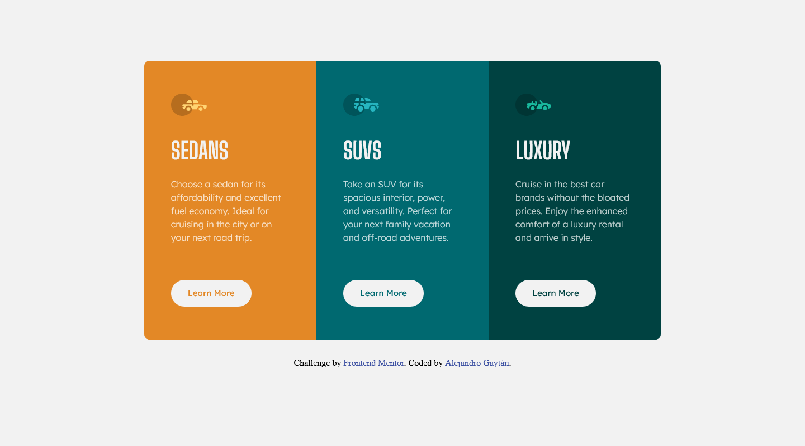
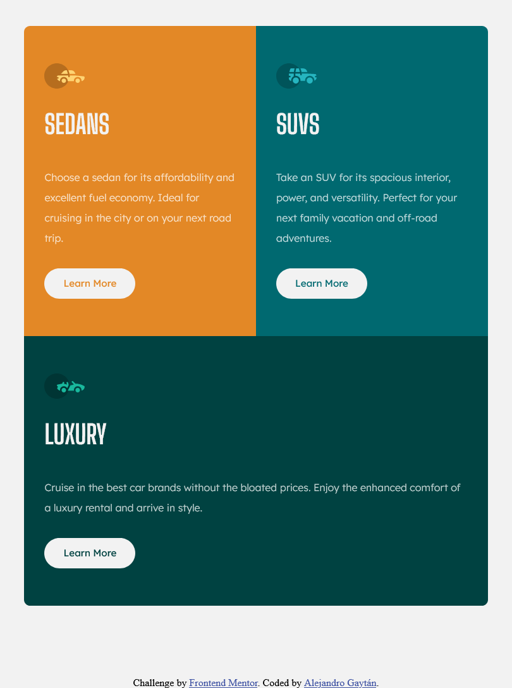
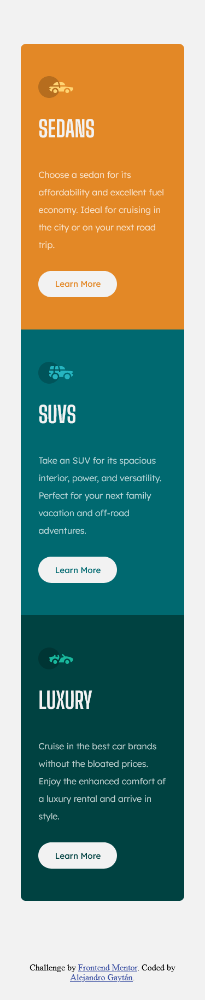

# Frontend Mentor - 3-column preview card component solution

This is a solution to the [3-column preview card component challenge on Frontend Mentor](https://www.frontendmentor.io/challenges/3column-preview-card-component-pH92eAR2-). 

## Table of contents

- [Overview](#overview)
  - [The challenge](#the-challenge)
  - [Screenshot](#screenshot)
  - [Links](#links)
- [My process](#my-process)
  - [Built with](#built-with)
  - [Continued development](#continued-development)
- [Author](#author)

## Overview

### The challenge

Users should be able to:

- View the optimal layout depending on their device's screen size
- See hover states for interactive elements

### Screenshot

  

  

  

### Links

- Solution URL: [Solution URL here](https://github.com/GGA-Alex/3-column-preview-card)
- Live Site URL: [Live site URL here](https://boring-heisenberg-712655.netlify.app/)

## My process

### Built with

- Semantic HTML5 markup
- CSS custom properties
- Flexbox
- CSS Grid
- Media queries
- Mobile-first workflow
- [Styled Components](style-guide.md)

### Continued development

- CSS Grid
- Media queries
- Mobile-first workflow

## Author

- Github - [Alejandro Gaytan](https://github.com/GGA-Alex)
- Frontend Mentor - [@GGA-Alex](https://www.frontendmentor.io/profile/GGA-Alex)
- Twitter - [@Alejandro_AGG07](https://twitter.com/Alejandro_AGG07)
